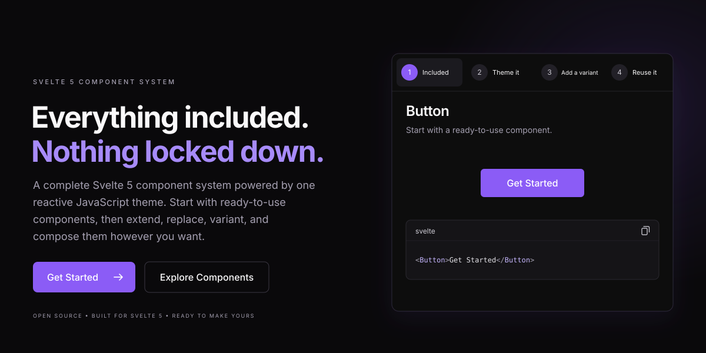

[](https://sveltewind.com)

# Sveltewind

A Svelte 5 component library styled with Tailwind CSS 4. Build from HTML primitives, compose richer UI, and customize every component through a shared theme.

[Documentation](https://sveltewind.com/getting-started/what-is-sveltewind) - [Components](https://sveltewind.com/components) - [Examples](https://sveltewind.com/examples/sass-landing-page) - [npm](https://www.npmjs.com/package/sveltewind)

## Why Sveltewind?

- **Composable components:** HTML primitives such as `A`, `Button`, `Details`, and `Summary`, alongside `Accordion`, `Dialog`, `Popover`, `Switch`, and more.
- **Shared styling:** Set base classes and reusable variants globally, or pass a separate theme to an individual component.
- **Independent style and color:** Five style presets and six primary palettes, with light and dark mode support.
- **Native Svelte:** Typed HTML attributes, snippets, event handlers, bindable elements, and configurable enter and exit transitions.
- **Tailwind overrides:** Component `class` values merge with theme classes using `tailwind-merge`.

## Installation

Use a Svelte 5 project with Tailwind CSS 4. For a new SvelteKit app, run:

```sh
npx sv create my-app
cd my-app
npx sv add tailwindcss
npm install sveltewind
```

If your project already has Svelte 5 and Tailwind CSS 4 configured, just install `sveltewind`.

Add the palette stylesheet and library source to `src/app.css`:

```css
@import 'tailwindcss';
@import 'sveltewind/themes/palettes.css';

/* Relative to src/app.css; adjust if your stylesheet lives elsewhere. */
@source '../node_modules/sveltewind/dist';

@custom-variant dark (&:where([data-theme=dark], [data-theme=dark] *));
```

Initialize the global theme and import the stylesheet in `src/routes/+layout.svelte`. Components use an empty global theme until you provide one.

```svelte
<script lang="ts">
	import '../app.css';
	import { theme } from 'sveltewind/theme';
	import { classic } from 'sveltewind/themes';

	let { children } = $props();

	theme.set.theme(structuredClone(classic));
</script>

{@render children()}
```

## Usage

Import components from `sveltewind/components`:

```svelte
<script lang="ts">
	import { Accordion, Alert, Badge, Button, Card, H2, P } from 'sveltewind/components';
</script>

<Card class="mx-auto max-w-lg space-y-4">
	<Badge variants={['success']}>Ready to build</Badge>
	<H2>Your next project</H2>
	<P>Start with components and make them your own.</P>
	<Button variants={['primary', 'pill']} onclick={() => console.log('Start building!')}>
		Get started
	</Button>
	<Accordion summary="Can I customize the styles?">
		<P>Yes. Use theme variants, Tailwind classes, or a theme of your own.</P>
	</Accordion>
	<Alert variants={['info']}>Your style and color palette are independent.</Alert>
</Card>
```

Most components share these props in addition to their native HTML attributes. Check the component documentation for specific bindings and behavior.

| Prop                             | Purpose                                                           |
| -------------------------------- | ----------------------------------------------------------------- |
| `class`                          | Add Tailwind utilities or override theme classes.                 |
| `variants`                       | Apply an ordered array of theme variants.                         |
| `theme`                          | Use a component-specific `Theme` instead of the global theme.     |
| `element`                        | Bind the underlying DOM element.                                  |
| `isVisible`                      | Control whether the component is rendered.                        |
| `transition`                     | Provide `[transitionFunction, options]` for entering and leaving. |
| `inTransition` / `outTransition` | Configure enter and exit transitions separately.                  |

For example, animate a component's visibility:

```svelte
<script lang="ts">
	import { Button, Card } from 'sveltewind/components';
	import { fade, fly } from 'svelte/transition';

	let visible = $state(true);
</script>

<Button onclick={() => (visible = !visible)}>Toggle card</Button>
<Card
	isVisible={visible}
	inTransition={[fly, { y: 12, duration: 200 }]}
	outTransition={[fade, { duration: 150 }]}
>
	Built with Svelte transitions.
</Card>
```

## Styles, colors, and dark mode

Choose a style preset by replacing the global theme:

```ts
import { theme } from 'sveltewind/theme';
import { classic, minimal, sharp, soft, studio } from 'sveltewind/themes';

theme.set.theme(structuredClone(soft));
```

| Preset    | Style                                       |
| --------- | ------------------------------------------- |
| `classic` | Balanced rounding, spacing, and outlines.   |
| `minimal` | Reduced decoration and simple borders.      |
| `sharp`   | Square corners and crisp edges.             |
| `soft`    | Generous rounding and softer surfaces.      |
| `studio`  | Rounded panels and more pronounced shadows. |

The former `default` export remains an alias for `classic`.

Presets control shape, spacing, and surface treatment. Set `data-color` on the root HTML element to independently select `violet`, `rose`, `sky`, `emerald`, `amber`, or `slate`. Violet is the initial palette. Set `data-theme="dark"` to enable the dark utilities configured above:

```html
<!-- src/app.html -->
<html lang="en" data-color="rose" data-theme="dark"></html>
```

To change preferences interactively, update these attributes in a browser event handler:

```ts
document.documentElement.dataset.color = 'emerald';
document.documentElement.dataset.theme = 'light';
```

Palettes update the `--color-primary-50` through `--color-primary-950` and `--color-secondary-50` through `--color-secondary-950` CSS variables. Secondary shades use the primary shade's OKLCH lightness with a +60° hue shift; chroma is reduced where needed to fit sRGB. Slate's secondary stays nearly neutral. Both `primary-*` and `secondary-*` Tailwind utilities follow the selected palette. Persist preferences in your app if you want them remembered across visits.

Components with primary colors in their base styles or a `primary` variant also provide `variants={['secondary']}`. Combine it after another variant to override shared primary color states, or use `bg-secondary-500`, `text-secondary-600`, and other secondary utilities directly. Override the secondary CSS variables independently to supply your own palette.

Secondary background variants retain the corresponding primary shade numbers in light and dark modes. Their text uses gray-50 or gray-950, selected for the better contrast against each shade via `--secondary-foreground-*` variables. When overriding secondary colors, update these foreground variables too.

Status colors keep their meaning across palettes: success is green, error and danger are red, warning is amber, and info is blue.

## Customize your theme

Extend base styles and create variants without changing component markup:

```ts
import { theme } from 'sveltewind/theme';

theme.update.base('button', 'font-semibold');
theme.set.variant('button', 'cta', 'rounded-full px-8 py-4 text-lg');
```

```svelte
<Button variants={['primary', 'cta']} class="w-full sm:w-auto">Start building</Button>
```

`set` replaces the targeted styles; `update` merges classes with the existing styles. Variants apply in array order, with the component's `class` prop merged last. You can also reference another component's styles with tokens such as `button.base` and `button.variant.outline`.

For a local override, create a separate theme and pass it to a component:

```svelte
<script lang="ts">
	import { Button } from 'sveltewind/components';
	import { Theme } from 'sveltewind/theme';
	import { classic } from 'sveltewind/themes';

	const localTheme = new Theme(structuredClone(classic));
	localTheme.update.base('button', 'rounded-full');
</script>

<Button theme={localTheme}>A local style</Button>
```

Clone exported presets before customizing them. Keep request-specific theme data out of the shared global theme in server-rendered applications; use separate `Theme` instances for that data.

## Developing locally

```sh
npm install
npm run dev
```

The repository includes the library and its SvelteKit documentation site.

- `src/lib/components` - primitives and composed components.
- `src/lib/theme` - reactive theme API.
- `src/lib/themes` - presets and color palettes.
- `src/routes` - documentation, examples, and the landing page.

Run `npm run check` for Svelte and TypeScript diagnostics, or `npm run build` to build the site, package the library, and validate package exports.

See [CHANGELOG.md](CHANGELOG.md) for release history. Report bugs or propose improvements through [GitHub issues](https://github.com/sveltewind/sveltewind/issues).

## License

Sveltewind is open source under the [MIT License](LICENSE).
